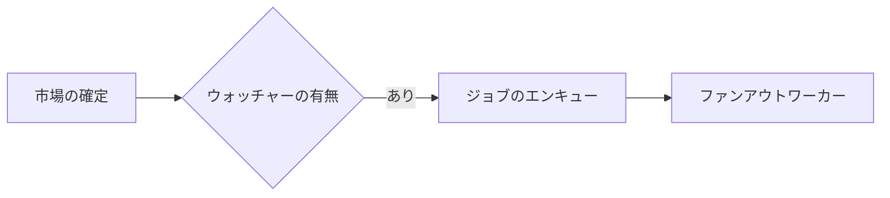

# Plan Canvas（計画キャンバス）

計画（プラン）および視覚的成果物のためのレビュー対話ループ: あなたが成果物を作成し、人間がブラウザ上でそれをレビューします — 意図する正確な要素に注釈を付け、チャットし、**「計画を承認（Approve plan）」または「修正を要求（Request changes）」** の判定を下します。エージェント側は、そのフィードバックをJSONとして受け取る単一のCLI呼び出しでブロック待機します。

[lavish-axi](https://github.com/kunchenguid/lavish-axi) に着想を得て、依存関係ゼロで `/plan` 確認ゲートを中心にECCネイティブとして再構築されました。

## 使用場面

- 計画成果物（`/plan` による `.claude/plans/*.plan.md`）を作成した直後で、確認/承認の決定が必要なとき — キャンバスでの判定が、テキストによる「yes/進めて」の代わりとなります。
- ユーザーが変更箇所を*画面上で直接指し示す*べきとき: デザイン、比較表、レポート、または任意のローカル `.md` / `.html` 成果物のレビュー。
- ユーザーが `/plan-canvas`、視覚的レビュー、または「ブラウザで開いて」と求めたとき。

差分のコードレビュー（`/code-review`）、Webアプリの直接実行、またはリモートURLには使用しないでください。キャンバスはローカルの成果物ファイルのみを配信します。

## 動作の仕組み

CLIコマンド `ecc-plan-canvas` として呼び出します（`ecc-universal` パッケージに含まれる実行ファイルで、グローバル/プラグインインストール後にPATHに通っています。プラグインインストールの場合は `node "$CLAUDE_PLUGIN_ROOT/scripts/plan-canvas.js"` も機能します）。レビュー対象のプロジェクトから実行します。任意の作業ディレクトリから動作します。全セッションで共有されるデタッチされたループバックサーバー（`127.0.0.1:4517`）を管理し、成果物パスをキーとして識別するため、セッションIDを追跡する必要はありません。

このワークフローはシンプルな「CLI ＋ JSON」のループであるため、モデルやハーネスに依存しません。シェルコマンドを実行して標準出力を読み取れる任意のエージェント（Claude Code、Codex、Cursor、Gemini、OpenCode、Copilot）で同様に動作します。お使いのハーネスが提供する方法（Claude Codeでは `/plan-canvas`、Codexでは `$plan-canvas` など）でトリガーするか、単に `ecc-plan-canvas` コマンドを直接実行してください。

```bash
# 1. ユーザーのブラウザで成果物を開く（即座に復帰します）
ecc-plan-canvas open .claude/plans/feature.plan.md

# 2. 人間が応答するまでブロック待機。実行したままにしておくこと。中断された場合は再実行:
#    キューに入ったフィードバックが失われることはありません。
ecc-plan-canvas await .claude/plans/feature.plan.md
```

### 待機状態を維持すること（さもないと相手は誰もいない席に向かって話すことになります）

フィードバックは、セッション上で実際に `await` が待機している間だけエージェントに届きます。何も受信待機していない状態でエージェントのターンが終了すると、メッセージはキューに滞留し、人間の画面からは送信ボタンを押しても何も起こらないように見えてしまいます。

そのため、お使いのハーネスがサポートしている場合は、**`await` をバックグラウンドタスクとして実行してください**（Claude Codeでは `run_in_background: true` のBash呼び出し）。フィードバックが届いた瞬間にコマンドが終了し、ハーネスからJSONが渡されるため、フォアグラウンド呼び出しの終了とともにループが途切れることなく、ターンをまたいで対話が継続します。フォアグラウンドでの `await` も動作しますが、ハーネスのタイムアウト制限までとなります。

2つのセーフティネットが存在しますが、どちらも上記を怠る理由にはなりません:

- `ecc-plan-canvas pending` — リスナーがいないままキューに入っているフィードバックを一覧表示します。何かを見落としたか不安なときはいつでも確認してください。
- `stop:plan-canvas-pending` フック — キャンバスのフィードバックが未配信の間はターンの終了をブロックし、メッセージをエージェントに渡します。このフックからフィードバックを読み取っている場合、受信待機を終了するのが早すぎたことを意味します。

人間がアクションを起こすと、`await` はJSONを出力します:

```json
{
  "status": "feedback",
  "items": [
    { "kind": "annotation", "text": "これを2つのフェーズに分割してください",
      "anchor": { "selector": "h2:nth-of-type(3)", "tag": "h2", "snippet": "Phase 2: Migration" } },
    { "kind": "verdict", "verdict": "request-changes" }
  ]
}
```

- `kind: "chat"` — 自由形式のチャットメッセージ。ターミナルではなくキャンバス内で返答します。
- `kind: "annotation"` — 特定の要素に固定された注釈（`anchor.selector`、`anchor.snippet` は指し示された要素を示し、文章をハイライトした場合は `anchor.textRange.text` が入ります）。
- `kind: "verdict"` — `approve` は計画が確認・承認（CONFIRMED）されたことを意味します: ポーリングを停止し、セッションを終了して実装を開始します。`request-changes` は成果物の修正を意味します（キャンバスが自動リロードします）。ループを継続してください。

**3. 必ずキャンバス内で返答し**、その後待機を継続します。以下の1つのコマンドで両方を実行できます:

```bash
ecc-plan-canvas await <file> --reply "ご要望通りフェーズ2を分割しました。ご確認ください。"
```

人間のすべてのメッセージに対してキャンバス内で返答を行います。「了解しました。リスク表を書き直しています」といった1行の返信であっても重要です。チャットパネルの沈黙はキャンバスの故障と見分けがつかず、まさにこのループが防止すべき障害そのものです。ターミナルだけでなく、キャンバス上で回答してください。

作業中は、アクティビティインジケーターを使ってチャットの状態を誠実に伝えます:

```bash
# アニメーション付きの「agent is thinking...（エージェントが考え中）」バブル。長時間の作業中は更新する
ecc-plan-canvas typing <file> --state thinking
# 返信が完了する直前に「agent is typing...（エージェントが入力中）」に切り替える
ecc-plan-canvas typing <file> --state typing
```

`await` はバッチを受け取った瞬間に自動的に `thinking` に設定し、`--reply` がそれをクリアします。どちらの状態も自動的に期限切れとなるため、エージェントがクラッシュした場合でも、相手に永遠にドットのアニメーションを見せ続けることなく、正常に「キュー待機中」に戻ります。修正作業が1分以上かかる場合は `thinking` を更新してください。

**4. 終了:** レビューが完了したら `ecc-plan-canvas end <file>` を実行します。

## 図解（Mermaid）

計画の一部がフローチャート、アーキテクチャ、シーケンス、ステートマシン、ER図、依存関係グラフなどである場合は、ASCIIアートや長文のテキストではなく、フェンス付きの ` ```mermaid ` ブロックとして作成してください。キャンバスは人間が直接指摘できるテーマ付きの図としてレンダリングします。文章よりも図の方が早く伝わる場合に活用し、単純なリストや表には不要です。

````markdown

````

図はアクセントパレット付きのECCダークテーマでレンダリングされます。Mermaidはピン留めされたCDNからブラウザに読み込まれます。オフライン等で利用できない場合、ブロックはソースコードの表示に縮退するため、レビューがブロックされることはありません。エアギャップ環境では `ECC_PLAN_CANVAS_MERMAID_URL` にローカルミラーを指定してください。

## ルール

- Markdown成果物はECCの計画テンプレート（Mermaidブロックを含む）でレンダリングされ、`.html` 成果物は注釈レイヤーが挿入された状態でそのままレンダリングされます。HTML作成のガイダンスについては `frontend-design-direction` および `artifact-design` スキルを参照してください。
- 修正するには成果物ファイルを直接編集します — キャンバスは保存時に自動リロードされます。更新のために `open` を再実行してはいけません。
- `{"status": "ended", "endedBy": "user"}`（またはフィードバックバッチ内の `sessionEnded: true`）は、ユーザーがレビューを終了したことを意味します: ポーリングを停止し、残りの更新はチャットで伝え、再度開かないでください。そのセッションに対する通常の `open` は拒否されます。再開を求められた場合のみ `--reopen` を渡してください。
- 兄弟アセット（画像、CSSなど）は成果物の隣に配置し、相対パスで参照する必要があります。
- サーバーはループバック専用で、30分間のアイドル状態（`ECC_PLAN_CANVAS_IDLE_MS`）の後に自動終了します。`stop` で明示的にシャットダウンできます。状態は `~/.claude/plan-canvas/`（`ECC_PLAN_CANVAS_STATE_DIR`）に保存されます。

## 具体例

**計画の承認フロー** — `/plan` が `.claude/plans/notifications.plan.md` を作成し、確認を待つ場合:

```bash
ecc-plan-canvas open .claude/plans/notifications.plan.md
ecc-plan-canvas await .claude/plans/notifications.plan.md
# → {"status":"feedback","items":[{"kind":"verdict","verdict":"approve"}]}
ecc-plan-canvas end .claude/plans/notifications.plan.md
# 計画が承認されました — 実装を開始します
```

**修正ループ** — フィードバックが届き、ファイルを編集して返信し、待機を継続する場合:

```bash
# await が注釈を返却 → .plan.md を編集（キャンバスが自動リロード）
ecc-plan-canvas await <file> --reply "リスク管理表を修正しました。"
# → 次の応答があるまで再びブロック待機
```

## アンチパターン

- ループ内で `--timeout-ms` を指定してポーリングすること。これはテスト用です。代わりに通常の `await` を待機させてください。
- レビューが開いている状態で、`await` による待機を行わずにターンを終了すること。人間が「メッセージを送ったのに何も反応がない」と体験する唯一の原因となります。
- フィードバックを読み取ったにもかかわらず、ターミナル内でのみ回答すること。人間はブラウザのキャンバスを見ています。
- ユーザー主導で終了された後に、何かを「見せるためだけ」に勝手に再オープンすること。
- 計画全体をチャットに貼り付けた*上で*キャンバスも開くこと — キャンバスを選択し、ターミナルのサマリーは1行にとどめてください。
- 状態ファイルから直接キャンバスのチャット内容をパースすること — 必要な情報はすべて `await` 経由で届きます。

設計ノートおよび詳細: [docs/design/plan-canvas.md](../../docs/design/plan-canvas.md)。
